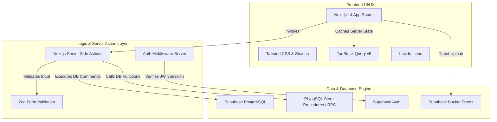
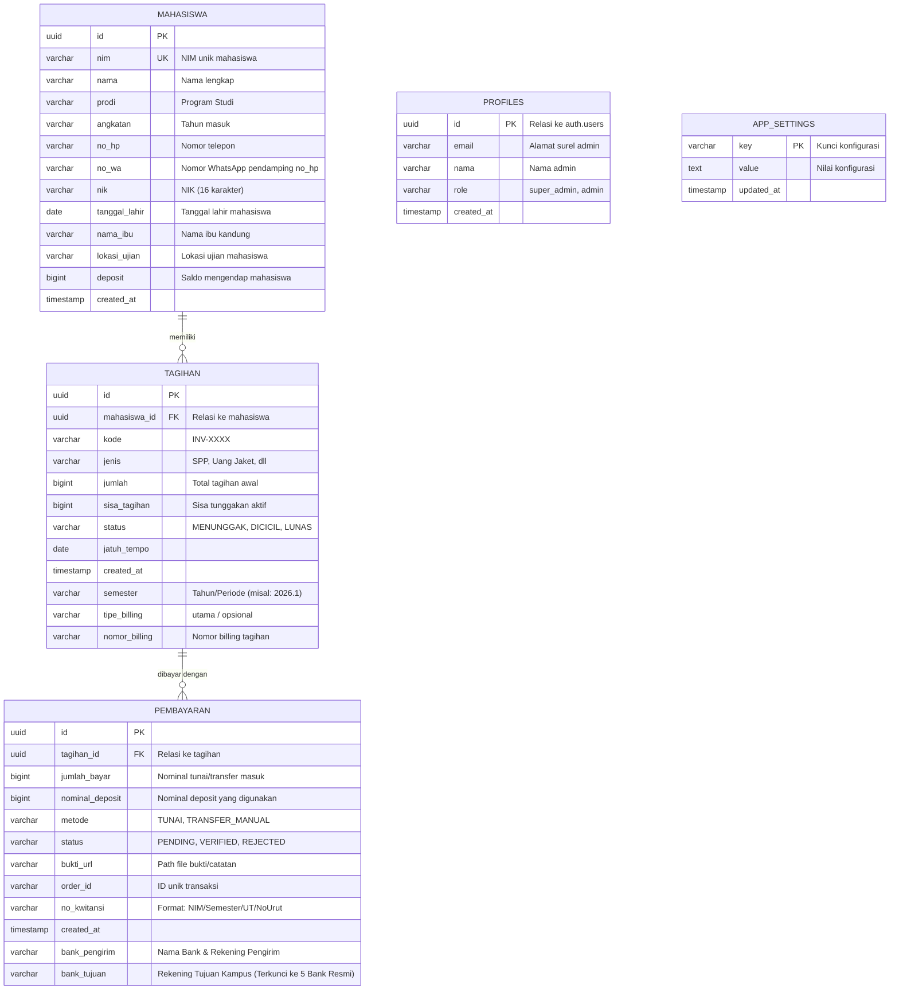
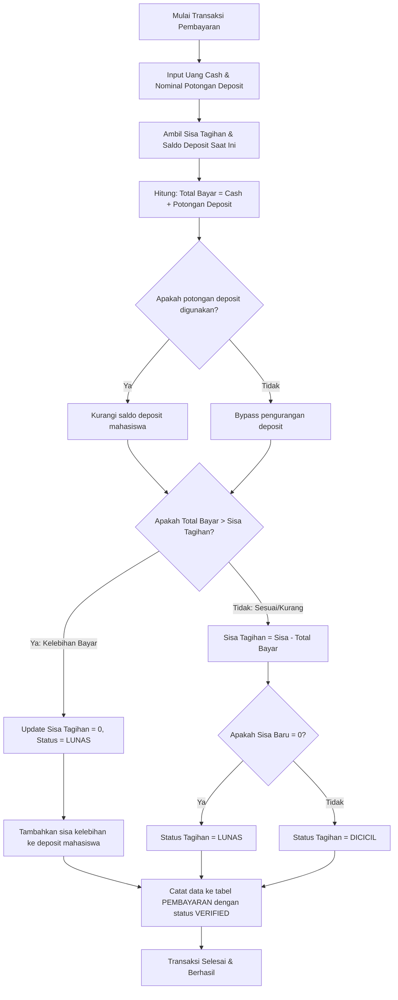

# 🌲 TECH TREE, BLUEPRINT, & ARSITEKTUR KEUANGAN UT SALATIGA

Dokumen arsitektur dan cetak biru (*blueprint*) ini memetakan seluruh ekosistem teknologi, skema basis data relasional, alur transaksi finansial secara atomik, dan pohon kapabilitas (*tech tree*) dari **Sistem Keuangan UT Salatiga** agar sinkron 100% dengan kode dan database produksi.

---

## 🏛️ 1. ARCHITECTURE OVERVIEW (TIGA LAYER UTAMA)

Sistem dirancang menggunakan arsitektur modern berbasis **Serverless Stack** dengan integrasi server-client yang aman dan berkinerja tinggi.



### A. Frontend Layer (UI/UX)
*   **Next.js 14 (React)**: Menggunakan rute halaman berbasis **App Router** (`src/app`) dengan struktur *Nested Layouts* untuk pembagian modul halaman secara dinamis.
*   **Tailwind CSS**: Mengimplementasikan *Design System* khusus (Gallery White background, Deep Navy headings, Emerald/Amber/Rose status badges) untuk estetika premium dan responsif.
*   **TanStack Query (React Query) v5**: Menyediakan manajemen state server-side (*caching*, *stale-while-revalidate*, *refetching* otomatis) untuk sinkronisasi antarmuka secara *real-time*.

### B. Logic Layer (Server Actions)
*   **Server Actions (`src/lib/actions/*`)**: Mengeliminasi kebutuhan API endpoint REST tradisional. Seluruh manipulasi data (penulisan, penghapusan, verifikasi) dilakukan secara aman di sisi server melalui fungsi-fungsi Server Actions.
*   **Zod Schema Validation**: Mencegah degradasi kualitas data basis data dengan melakukan validasi tipe dan format data (misal NIM, nominal uang) sebelum dieksekusi di server.
*   **Next.js Middleware**: Berfungsi sebagai *gatekeeper* keamanan sisi server, mencegat rute-rute dashboard (`/`) dari akses pengguna tidak sah (belum terautentikasi).

### C. Database & Storage Layer (Supabase Serverless Engine)
*   **PostgreSQL Engine**: Sistem penyimpanan data relasional terstruktur dengan pengamanan *Row Level Security (RLS)*.
*   **Supabase Auth**: Menangani manajemen akun admin (staf & super admin) berbasis JSON Web Tokens (JWT).
*   **Supabase Storage**: Menyimpan dokumen bukti transfer mahasiswa di dalam bucket khusus.
*   **Remote Procedure Calls (RPC)**: Logika transaksi finansial kritis dijalankan langsung di database (database-level atomic transaction) guna menjamin keandalan data (*ACID properties*).

---

## 🌲 2. TECH TREE (POHON KAPABILITAS SISTEM)

Pohon kapabilitas ini menggambarkan hierarki fungsional dari modul dasar hingga fitur otomatisasi finansial tingkat lanjut.

```
[ SISTEM KEUANGAN UT SALATIGA ]
 ├── [1. MANAGEMENT CORE]
 │    ├── Data Biodata Mahasiswa Lengkap (NIM, NIK, Tgl Lahir, Nama Ibu, No WA/HP, Lokasi Ujian)
 │    │    └── Impor Massal Excel (.xlsx parsing & validation)
 │    ├── Manajemen Akun Admin
 │    │    └── Role-Based Access Control (RBAC: Super Admin vs Staff Admin)
 │    └── Konfigurasi Aplikasi (Prefix Kwitansi, Nominal Default)
 ├── [2. BILLING ENGINE]
 │    ├── Multi-Billing Creation (Pencatatan Tagihan Baru)
 │    ├── Cicilan & Angsuran Logic (Status Kode: MENUNGGAK, DICICIL, LUNAS)
 │    └── Riwayat Mutasi Tagihan
 ├── [3. TRANSACTION & DEPOSIT SYSTEM]
 │    ├── Payment Gate (TUNAI & TRANSFER_MANUAL)
 │    ├── Auto-Deposit Generator (Uang kembalian bayar otomatis masuk deposit)
 │    ├── Deposit Utilization (Penggunaan saldo deposit sebagai pemotong tagihan)
 │    └── Atomic Database RPC execution (Bypass Verifikasi jika dibayar penuh via deposit)
 ├── [4. AUDITING & VERIFICATION]
 │    ├── Antrean Verifikasi Status 'PENDING'
 │    ├── Lightbox Preview Bukti Transfer & Fullscreen Zoom
 │    ├── Approval/Rejection Log (Status: VERIFIED / REJECTED)
 │    └── Auto-Receipt Pop-up (Kwitansi instan langsung muncul setelah verifikasi disetujui)
 └── [5. REPORTING & OUTPUT]
      ├── Rekapitulasi Pembukuan & Filter Multi-Kriteria (Pemasukan, Tunggakan, Antrean)
      ├── Direct Print Kwitansi (Cetak ulang kwitansi riwayat transaksi)
      ├── Kwitansi Terbilang Otomatis (Konversi angka ke bahasa Indonesia)
      └── Ekspor Laporan Excel (.xlsx) instan
```

---

## 🗄️ 3. BLUEPRINT DATA & SKEMA BASIS DATA (ERD)

Skema relasi tabel dirancang secara normal untuk menghindari redundansi dan menjaga integritas data keuangan mahasiswa.



### Penjelasan Detak Kolom Khusus:
1.  **Tabel `MAHASISWA`**:
    *   `deposit`: Menyimpan dana lebih atau uang muka mahasiswa. Bertindak sebagai *single source of truth* untuk saldo mengendap mahasiswa.
    *   `nik`: VARCHAR(16) untuk menyimpan Nomor Induk Kependudukan.
    *   `tanggal_lahir`: DATE untuk mencatat tanggal lahir secara terstruktur.
    *   `nama_ibu`: VARCHAR(255) untuk mencatat nama ibu kandung.
    *   `no_wa`: VARCHAR(255) sebagai nomor WhatsApp utama pendamping data kontak `no_hp`.
    *   `lokasi_ujian`: VARCHAR(255) untuk memetakan lokasi pelaksanaan ujian mahasiswa.
2.  **Tabel `TAGIHAN`**:
    *   `sisa_tagihan`: Menggunakan basis data BigInt untuk akurasi nilai finansial. Sisa tagihan akan berkurang seiring masuknya transaksi pembayaran yang berstatus sukses (`VERIFIED` atau `LUNAS`).
    *   `status`: Status tagihan di tingkat kode menggunakan nilai `MENUNGGAK` (di tingkat antarmuka dirender dengan teks visual "Belum Lunas" dan badge Crimson/Merah), `DICICIL` (badge Amber/Jingga), dan `LUNAS` (badge Emerald/Hijau).
3.  **Tabel `PEMBAYARAN`**:
    *   `no_kwitansi`: Dibuat dinamis menggunakan format resmi: `NIM/TahunSemester/UT/NomorUrutHariIni` (misal: `041234567/2026.1/UT/003`).
    *   `bank_tujuan`: Dikunci secara ketat di tingkat antarmuka dan backend untuk **5 rekening bank resmi atas nama ARIENTA DWI PUTRA**:
        *   **BNI**: `0217162820`
        *   **BCA**: `0130789935`
        *   **BRI**: `603901010339531`
        *   **CIMB**: `8010106636164`
        *   **MANDIRI**: `1350012958797`
        *   *Catatan*: Pengelolaan dan pengambilan opsi rekening resmi ini dikelola melalui server action `getRekeningKampus` dengan fallback basis data tabel `rekening_kampus`.

---

## ⚙️ 4. BLUEPRINT LOGIKA BISNIS KRITIS (WORKFLOWS)

### A. Alur Transaksi & Penghitungan Deposit Otomatis
Fungsi PL/pgSQL RPC `process_manual_payment` menjamin proses pembukuan saldo berjalan secara atomik.



### B. Mekanisme Verifikasi Bukti Bayar & Auto-Receipt Pop-up
Untuk transaksi via Transfer, sistem memberlakukan masa tinjau (*pending queue*) untuk memverifikasi dana fisik di rekening giro kampus sebelum memotong saldo tagihan.

1.  **Unggah Bukti**: Mahasiswa/Admin mengunggah gambar bukti transfer. Pembayaran dicatat dengan status `PENDING` (sisa tagihan belum berkurang).
2.  **Antrean Verifikasi**: Pembayaran masuk ke halaman `/verifikasi`.
3.  **Verifikasi Admin**: Staf Keuangan meninjau bukti transfer.
    *   Jika **DITOLAK**: Transaksi diupdate menjadi `REJECTED`. Selesai.
    *   Jika **DISETUJUI**:
        *   Sistem memicu RPC `process_manual_payment` secara otomatis di backend.
        *   Status pembayaran diubah menjadi `VERIFIED`.
        *   Sisa tagihan didebit berdasarkan nominal transfer.
        *   **Auto-Receipt Trigger**: Sinyal sukses dikirimkan ke frontend, yang seketika memunculkan modal `<OfficialReceipt>` secara instan di layar admin tanpa harus reload halaman.

---

## 📊 5. SISTEM PELAPORAN & AUDIT DUA ARAH (REPORTING & OUTPUT)

### Detail Audit Kwitansi Resmi
Setiap transaksi pembayaran yang sukses (`LUNAS` atau `VERIFIED`) menghasilkan dokumen bukti kwitansi resmi melalui komponen `OfficialReceipt.tsx` (untuk cetak instan) dan `ReceiptTemplate.tsx` (untuk template jendela cetak). 

Sistem menerapkan **audit dua arah yang ketat** untuk rekonsiliasi kas dan rekening koran bank:
*   **"Transfer Dari" (Pengirim)**: Menampilkan nama lengkap dan NIM mahasiswa pembayar secara eksplisit pada badan kwitansi. Jika pembayaran berupa transfer, ia mencantumkan detail nama bank asal dan nama pemilik rekening pengirim (a.n. pengirim).
*   **"Transfer Ke" (Penerima)**: Menampilkan detail rekening kampus tujuan secara spesifik (BNI/BCA/BRI/CIMB/MANDIRI) agar auditor dapat mencocokkan mutasi kas masuk dengan nomor rekening resmi yang tepat. Jika transaksi dilakukan secara tunai, kolom ini secara tegas menuliskan `"Tunai via Kasir / Admin"`.

Kwitansi juga secara otomatis melakukan kalkulasi:
*   **Terbilang Otomatis**: Mengonversi nilai nominal numerik transaksi menjadi representasi tekstual (ejaan bahasa Indonesia).
*   **Pencatatan Deposit & Tunai**: Merinci pembagian pembayaran yang berasal dari uang tunai/transfer segar dan kontribusi potongan deposit mahasiswa.
