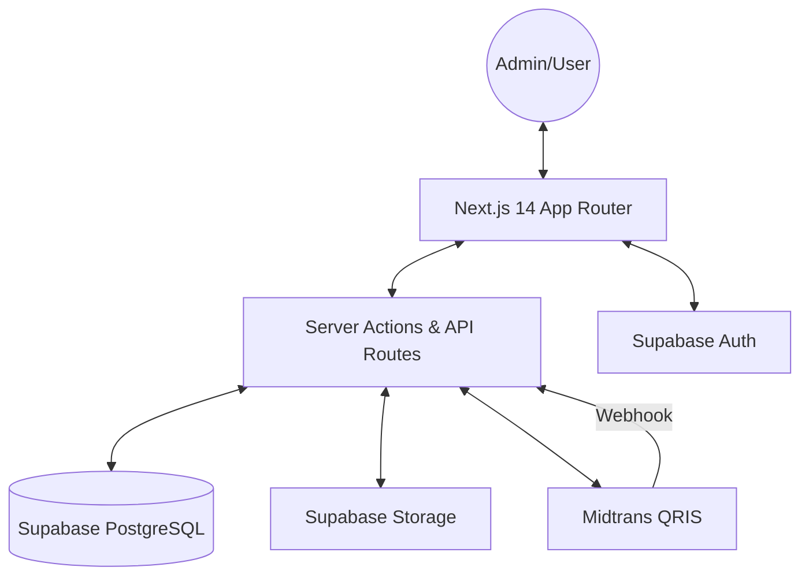
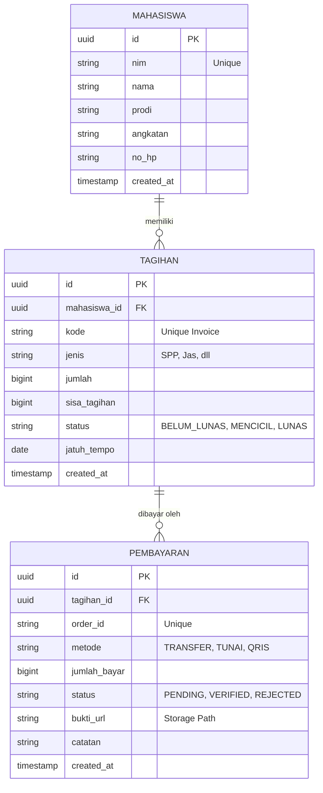

# System Walkthrough: Administrasi & Keuangan UT Salatiga

Dokumen ini berfungsi sebagai panduan teknis internal untuk memahami arsitektur, alur kerja, dan struktur teknis dari platform Manajemen Keuangan Mahasiswa UT Salatiga.

---

## 1. Arsitektur Sistem

Aplikasi ini dibangun menggunakan arsitektur modern berbasis cloud dengan komunikasi real-time antara frontend dan backend.



---

## 2. Skema Database

Sistem menggunakan PostgreSQL di Supabase dengan relasi antar tabel sebagai berikut:



---

## 3. Alur Autentikasi

1.  **Provider**: Menggunakan **Supabase Auth** (Email/Password).
2.  **Middleware**: Proteksi rute di sisi server menggunakan Next.js Middleware. Rute `/(dashboard)` tidak dapat diakses tanpa sesi aktif.
3.  **RLS (Row Level Security)**: Setiap tabel memiliki kebijakan RLS untuk memastikan data hanya dapat dimodifikasi oleh admin yang terautentikasi.

---

## 4. Manajemen Mahasiswa

-   **Registrasi**: Mendukung pendaftaran tunggal dengan input biodata lengkap.
-   **Multi-Billing**: Saat pendaftaran, admin dapat menambahkan banyak tagihan awal sekaligus.
-   **Import Excel**: Fitur batch processing untuk mengunggah ribuan data mahasiswa menggunakan library `xlsx`.
-   **Server-side Pagination**: Pencarian dan pagination dilakukan di sisi database untuk performa maksimal pada dataset besar.

---

## 5. Sistem Tagihan & Pembayaran

Sistem ini dirancang sangat fleksibel untuk mendukung berbagai skenario pembayaran:

### A. Tipe Pembayaran
1.  **Pembayaran Parsial (Cicilan)**: Mahasiswa dapat membayar sebagian dari total tagihan. Sistem akan mengupdate `sisa_tagihan` secara otomatis.
2.  **Lunas Sekaligus**: Pembayaran yang langsung menutup seluruh sisa tagihan.

### B. Metode Pembayaran
-   **Transfer Manual**: User mengunggah bukti transfer. Admin kemudian melakukan verifikasi melalui dashboard.
-   **Tunai (Cash)**: Admin menerima uang langsung dan mencatatnya ke sistem (Auto-verified).
-   **QRIS (Midtrans)**: Integrasi otomatis (jika diaktifkan) menggunakan Snap.js dan Webhook.

### C. Logika Bisnis (RPC)
Setiap transaksi pembayaran memicu prosedur database (**RPC `process_manual_payment`**) yang menjamin atomisitas:
-   Insert data pembayaran.
-   Update sisa tagihan.
-   Update status tagihan (`MENCICIL` atau `LUNAS`).

---

## 6. Dashboard & Laporan

-   **Metrik Real-Time**: Total Pemasukan, Total Tunggakan, dan Antrean Verifikasi dihitung langsung dari database.
-   **Tanpa Cache**: Dashboard menggunakan `revalidate = 0` untuk memastikan data selalu akurat.
-   **Laporan**: Filter berdasarkan rentang tanggal, jenis tagihan, dan metode pembayaran dengan fitur pencetakan kwitansi otomatis.

---

## 7. Desain Responsif

Antarmuka dibangun dengan prinsip **"Mobile-First"**:
-   **Desktop**: Sidebar navigasi permanen dengan layout lebar.
-   **Mobile**: Menggunakan **Bottom Navigation** untuk akses cepat dan **Drawer** untuk menu samping.
-   **Stacked Cards**: Tabel data berubah menjadi kartu bertumpuk pada layar kecil untuk kemudahan baca.

---

## 8. Keamanan

1.  **Atomic Transactions**: Menggunakan transaksi PostgreSQL agar data tidak korup jika terjadi kegagalan di tengah proses.
2.  **Environment Variables**: Kunci sensitif (Supabase Service Key, Midtrans Server Key) hanya tersedia di sisi server.
3.  **Validation**: Validasi skema ketat menggunakan **Zod** pada formulir dan API.

---

## 9. Struktur Folder

```text
src/
├── app/               # Next.js App Router (Pages & API)
├── components/        # UI Components (Atomic Design)
│   ├── dashboard/     # Widget & Chart Dashboard
│   ├── students/      # Modal & Form Mahasiswa
│   ├── payments/      # Logika Pembayaran & Kwitansi
│   └── ui/            # Base components (shadcn/ui)
├── hooks/             # Custom React Hooks (SWR/Data Fetching)
├── lib/               # Shared Utilities
│   ├── actions/       # Next.js Server Actions (Business Logic)
│   ├── supabase/      # Client & Server Supabase Config
│   └── utils/         # Helper functions (Formatting, Terbilang)
└── types/             # TypeScript Definitions
```

---

## 10. Setup & Deployment

### Langkah Instalasi
1.  **Clone Repo**: `git clone [url-repo]`
2.  **Install Dependencies**: `npm install`
3.  **Env Setup**: Copy `.env.example` ke `.env.local` dan isi kredensial Supabase.
4.  **Run Dev**: `npm run dev`

### Deployment
-   **Platform**: Direkomendasikan di **Vercel**.
-   **Database**: Migrasi schema PostgreSQL ke Supabase.
-   **Storage**: Pastikan Bucket `pembayaran` tersedia di Supabase Storage dengan akses publik/privat yang sesuai.

---
*Dokumentasi ini dibuat oleh Sistem Antigravity untuk tim UT Salatiga.*
